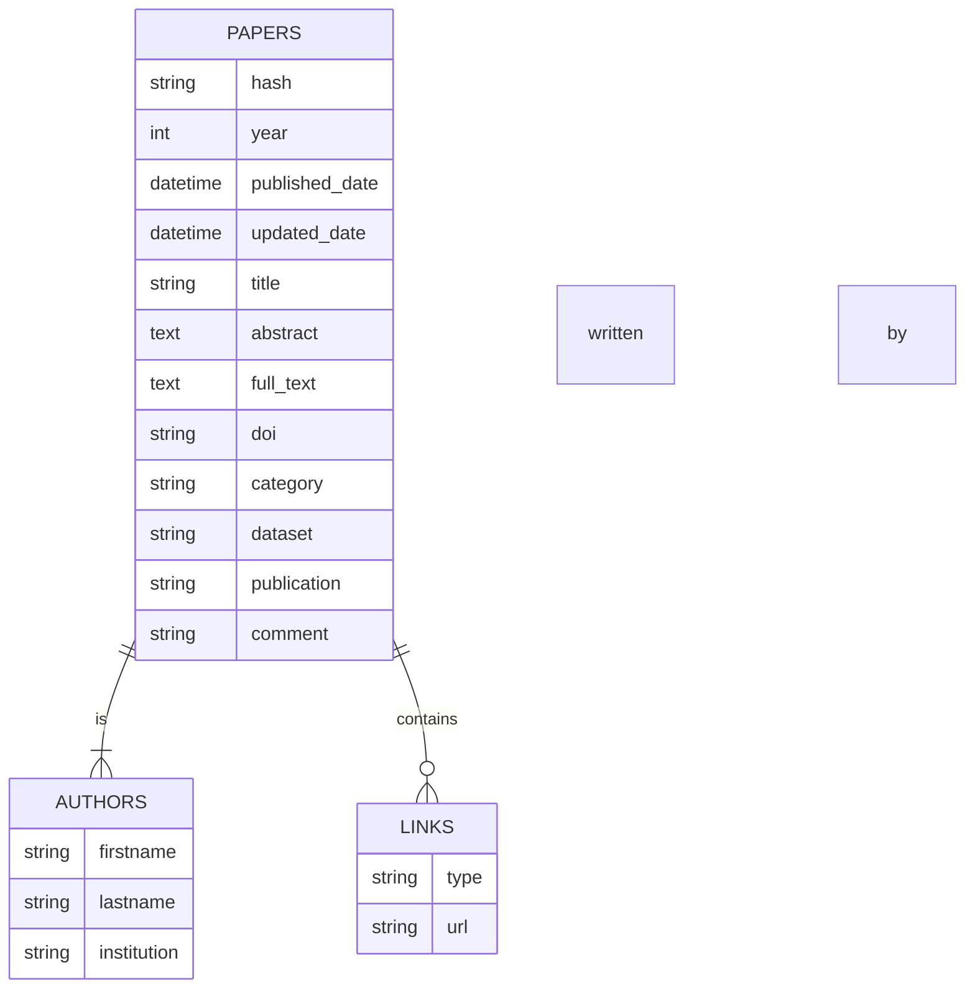

# Modèles ORM

## Avantages d'un ORM

ORM, ou Object-Relational-Mapping, est une technique fréquemment utilisée dans les applications web. Le principe est de créer un lien abstrait entre l’application et la base de données dont elle dépend par une couche supplémentaire.

Elle s’applique sur les bases de données relationnelles (SQL) et consiste principalement à transformer chaque table en une entité ou classe. De cette manière, on peut s’affranchir des requêtes SQL générées au sein du programme.

L’ORM supporte les relations entre entités :

- **One-To-One :** une table prend un objet de la deuxième classe en argument
- **One-To-Many / Many-To-One :** la première classe prend en argument une liste d’objets de la seconde classe et la seconde classe prend l’objet de référence de la première classe
- **Many-To-Many** : on utilise une classe intermédiaire qui prend en argument deux listes d’objets liés

### Lien avec la base de données

Les arguments sont stockés dans la couche au cours d’une opération. Cette couche doit donc être réglée de sorte à avoir une stratégie en tête lorsqu’elle doit mettre à jour la base de données. De plus, les relations entre entités sont dépendantes les unes aux autres. Si une classe est affectée, on obtient une réaction en chaîne.

#### Cascading

Le cascading ou réaction en chaîne, est l’effet d’une opération sur une entité, qui peut être appliquée sur toutes les entités dépendantes.

#### Chargement

Le chargement des données consiste à aller chercher les entrées dans la base de donnée, comme elles ne sont pas chargées par défaut. L’entité fait uniquement office de classe de passage. Il existe deux types de chargement :

- Chargement fainéant : on récupère juste les données lors de l’initialisation d’un objet
- Chargement enthousiaste : l’initialisation des données se fait sur le coup
